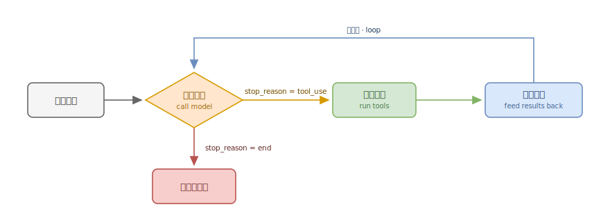
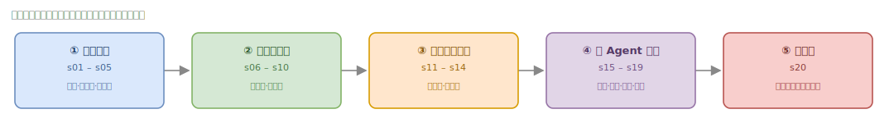

# Claude Code Harness Notes · 一份读懂 Agent Harness 的学习笔记

中文 · **[English](README.en.md)**

> **Agent 的强大不来自更聪明的模型循环，而来自循环周围那层不断成熟的 harness。**

这是我精读教学项目 [`shareAI-lab/learn-claude-code`](https://github.com/shareAI-lab/learn-claude-code) 后沉淀的学习笔记。它不是源码搬运，而是回答三个问题：

1. **一个 coding agent 的 harness 到底是怎么搭起来的？** —— 用一个永不改变的循环 + 20 个层层叠加的机制讲清楚。
2. **每个机制解决什么问题、怎么实现？** —— 逐课提炼 + 心智模型 + 代码锚点（直达源码行）。
3. **不同 agent 框架的取舍有何不同？** —— 把它和 **Claude Code**、开源的 **pi** 放在一起横向对比。

读完你应该能从零讲清：*为什么 `Agent = Model + Harness`，以及当你要做自己的 agent 时，每个机制该不该上、该怎么选。*

---

## 🧭 怎么读这份笔记

```
┌─────────────┐   先建立心智模型      ┌──────────────────────┐
│ 00 心智模型  │ ───────────────────► │  那个永不改变的循环      │
└─────────────┘                      │  + 机制层层叠加的范式    │
                                     └──────────┬───────────┘
                                                │ 然后逐篇深入
        ┌───────────────┬───────────────┬───────┴───────┬───────────────┐
        ▼               ▼               ▼               ▼               ▼
   01 基础设施      02 上下文工程     03 健壮性与编排   04 多Agent协作    05 集大成
   (s01–s05)       (s06–s10)        (s11–s14)        (s15–s19)        (s20)
        └───────────────┴───────────────┴───────┬───────┴───────────────┘
                                                │ 最后看横向对比 / 选型
                                       ┌────────┴────────┐
                                       ▼                 ▼
                              对比 CC × pi        选型决策表（动手时查这个）
```

| 文件 | 内容 | 一句话 |
|---|---|---|
| [notes/00-mental-model.md](notes/00-mental-model.md) | 核心心智模型 | `Agent = Model + Harness`，那个不变的循环 |
| [notes/01-foundations.md](notes/01-foundations.md) | s01–s05 基础设施 | 把循环打磨成安全、可扩展、有规划 |
| [notes/02-context.md](notes/02-context.md) | s06–s10 上下文工程 | 让 Agent 跑得久、记得住（最核心一篇） |
| [notes/03-robustness.md](notes/03-robustness.md) | s11–s14 健壮性与编排 | 扛得住、排得开、不阻塞、自动跑 |
| [notes/04-multi-agent.md](notes/04-multi-agent.md) | s15–s19 多 Agent 协作 | 通信→约定→自治→隔离→外联 |
| [notes/05-capstone.md](notes/05-capstone.md) | s20 集大成 | 机制很多，循环一个 |
| [compare/claude-code-vs-pi.md](compare/claude-code-vs-pi.md) | Claude Code × pi 对比 | 同一个循环，两条相反的 harness 哲学 |
| [cheatsheets/decision-table.md](cheatsheets/decision-table.md) | 选型决策表 | 做自己的 agent 时该上哪个机制 |
| [notes/lessons/](notes/lessons/) | **20 课逐课独立页** | 每课一页，便于浏览/收藏（中英双语） |
| [minimal/](minimal/) | **最小可跑 agent** | ~120 行，clone 下来就能跑 |

---

## 📐 一张图看懂：永不改变的循环



`while stop_reason == "tool_use"` 这 30 行循环，从 s01 到 s20 **一字未改**。复杂度全部沉淀在循环**周围**的 harness 层，而非大脑本身。



---

## 🗂️ 20 课速查目录

> 「课」名跳转到对应笔记，「源码」直达 `learn-claude-code` 仓库的关键实现行。

**基础设施 → [notes/01](notes/01-foundations.md)**

| 课 | 机制 | 一句话洞见 | 源码 |
|---|---|---|---|
| [s01](notes/lessons/s01.md) | Agent Loop | 一个循环 + Bash 就是一个 Agent | [code.py:85](https://github.com/shareAI-lab/learn-claude-code/blob/main/s01_agent_loop/code.py#L85) |
| [s02](notes/lessons/s02.md) | 工具分发 | 加工具只加 handler，循环不动 | [code.py:138](https://github.com/shareAI-lab/learn-claude-code/blob/main/s02_tool_use/code.py#L138) |
| [s03](notes/lessons/s03.md) | 权限管线 | 信任代码，不信任模型 | [code.py:185](https://github.com/shareAI-lab/learn-claude-code/blob/main/s03_permission/code.py#L185) |
| [s04](notes/lessons/s04.md) | Hooks | 挂在循环上，不写进循环里 | [code.py:160](https://github.com/shareAI-lab/learn-claude-code/blob/main/s04_hooks/code.py#L160) |
| [s05](notes/lessons/s05.md) | TodoWrite | 没有计划的 agent 走哪算哪 | [code.py:144](https://github.com/shareAI-lab/learn-claude-code/blob/main/s05_todo_write/code.py#L144) |

**上下文工程 → [notes/02](notes/02-context.md)**

| 课 | 机制 | 一句话洞见 | 源码 |
|---|---|---|---|
| [s06](notes/lessons/s06.md) | 子 Agent 隔离 | 大任务拆小，每个干净上下文 | [code.py:207](https://github.com/shareAI-lab/learn-claude-code/blob/main/s06_subagent/code.py#L207) |
| [s07](notes/lessons/s07.md) | Skill 按需加载 | 用到时再加载，别全塞 prompt | [code.py:69](https://github.com/shareAI-lab/learn-claude-code/blob/main/s07_skill_loading/code.py#L69) |
| [s08](notes/lessons/s08.md) | 上下文压缩 | 便宜的先跑，贵的后跑 | [code.py:339](https://github.com/shareAI-lab/learn-claude-code/blob/main/s08_context_compact/code.py#L339) |
| [s09](notes/lessons/s09.md) | 记忆 | 压缩会丢细节，要有一层不丢 | [code.py:132](https://github.com/shareAI-lab/learn-claude-code/blob/main/s09_memory/code.py#L132) |
| [s10](notes/lessons/s10.md) | Prompt 组装 | Prompt 是组装出来的，不是写死的 | [code.py:50](https://github.com/shareAI-lab/learn-claude-code/blob/main/s10_system_prompt/code.py#L50) |

**健壮性与编排 → [notes/03](notes/03-robustness.md)**

| 课 | 机制 | 一句话洞见 | 源码 |
|---|---|---|---|
| [s11](notes/lessons/s11.md) | 错误恢复 | 错误不是终点，是重试的起点 | [code.py:182](https://github.com/shareAI-lab/learn-claude-code/blob/main/s11_error_recovery/code.py#L182) |
| [s12](notes/lessons/s12.md) | 任务图(DAG) | 拆成小任务，排好序，持久化 | [code.py:99](https://github.com/shareAI-lab/learn-claude-code/blob/main/s12_task_system/code.py#L99) |
| [s13](notes/lessons/s13.md) | 后台任务 | 慢操作丢后台，Agent 继续处理 | [code.py:344](https://github.com/shareAI-lab/learn-claude-code/blob/main/s13_background_tasks/code.py#L344) |
| [s14](notes/lessons/s14.md) | Cron 调度 | 按时间表生产工作，调度与执行解耦 | [code.py:519](https://github.com/shareAI-lab/learn-claude-code/blob/main/s14_cron_scheduler/code.py#L519) |

**多 Agent 协作 → [notes/04](notes/04-multi-agent.md)**

| 课 | 机制 | 一句话洞见 | 源码 |
|---|---|---|---|
| [s15](notes/lessons/s15.md) | Agent 团队 | 一个搞不定，组队来 | [code.py:595](https://github.com/shareAI-lab/learn-claude-code/blob/main/s15_agent_teams/code.py#L595) |
| [s16](notes/lessons/s16.md) | 团队协议 | 队友之间要有约定 | [code.py:389](https://github.com/shareAI-lab/learn-claude-code/blob/main/s16_team_protocols/code.py#L389) |
| [s17](notes/lessons/s17.md) | 自治 Agent | 自己看板，自己认领 | [code.py:292](https://github.com/shareAI-lab/learn-claude-code/blob/main/s17_autonomous_agents/code.py#L292) |
| [s18](notes/lessons/s18.md) | Worktree 隔离 | 各干各的，互不干扰 | [code.py:189](https://github.com/shareAI-lab/learn-claude-code/blob/main/s18_worktree_isolation/code.py#L189) |
| [s19](notes/lessons/s19.md) | MCP 插件 | 外接工具，标准协议 | [code.py:754](https://github.com/shareAI-lab/learn-claude-code/blob/main/s19_mcp_plugin/code.py#L754) |

**集大成 → [notes/05](notes/05-capstone.md)**

| 课 | 机制 | 一句话洞见 | 源码 |
|---|---|---|---|
| [s20](notes/lessons/s20.md) | 全机制 · 一个循环 | 机制很多，循环一个 | [code.py:1955](https://github.com/shareAI-lab/learn-claude-code/blob/main/s20_comprehensive/code.py#L1955) |

---

## 🙏 致谢与版权

- 本仓库是对开源教学项目 [`shareAI-lab/learn-claude-code`](https://github.com/shareAI-lab/learn-claude-code) 的学习笔记，所有源码版权归原项目所有；强烈建议配合原项目源码一起阅读。
- 对比涉及的 [pi](https://github.com/earendil-works/pi) 为 earendil-works 的开源项目。
- 笔记内容（文字与图）以 [MIT License](LICENSE) 开放，欢迎 issue / PR 指正。

> 如果这份笔记帮到了你，欢迎 ⭐ 一下，也别忘了给 [原项目](https://github.com/shareAI-lab/learn-claude-code) 点个 star。
