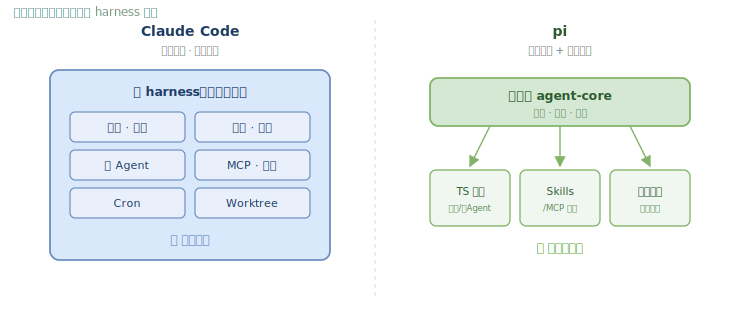

**[中文](claude-code-vs-pi.md)** · English

# Claude Code × pi: A Side-by-Side Comparison

> Few people have systematically compared this: **one and the same agent loop can support two opposite harness philosophies.**

What we're comparing (two **production-grade** frameworks):
- **Claude Code** — Anthropic's closed-source commercial product (CLI/IDE/Web)
- **pi** — earendil-works' open-source agent toolkit (TypeScript, [earendil-works/pi](https://github.com/earendil-works/pi))

> These notes are based on the teaching project [`learn-claude-code`](https://github.com/shareAI-lab/learn-claude-code), which rebuilds Claude Code's mechanisms lesson by lesson. The last column of the table below links to its lesson pages as a "where to learn this from scratch" pointer (**it is not part of the comparison**).

---

## 0. Plotting the Two

```
        Degree of built-in mechanisms (batteries-included)
        High ▲   ● Claude Code
             │   (closed·production·all mechanisms built in)
             │
             │              ● pi
             │         (TS·production·minimal core + extension-first)
        Low  │
             └──────────────────────────────────────►
               closed / product                   open / hackable
```

| Dimension | **Claude Code** | **pi** |
|---|---|---|
| Nature | commercial product (CLI/IDE/Web) | open-source agent toolkit |
| Language | closed source | TypeScript (monorepo packages) |
| Goal | **use** a mature harness to get work done | **adapt/embed** a harness into your own product |
| Philosophy | everything out of the box | minimal core + extension-first |
| Code layout | — | `pi-ai` / `pi-agent-core` / `pi-coding-agent` / `pi-tui` |

---

## 1. The Philosophical Split: Built-in vs Extension

This is the single most important diagram — **same loop, two opposite routes**:



<details><summary>📄 ASCII version (terminal-friendly)</summary>

```
                         Claude Code                        pi
                    ─────────────────────       ─────────────────────
   Core loop         ✅ model→tool→result         ✅ agentLoop iterator
   How mechanisms    "Built-in, layered" —        "Minimal core + extension-first"
   are supplied      all included                 most of these are NOT built in;
                     permission/subagent/MCP/Plan  build them as extensions yourself
                     are all built-in parts

        ┌────────────────────────┐        ┌────────────────────────┐
        │   Claude Code model     │        │      pi model           │
        │  ┌──────────────────┐  │        │  ┌──────────────────┐  │
        │  │ thick harness     │  │        │  │ thin agent-core   │  │
        │  │ (built in)        │  │        │  │ kernel            │  │
        │  │ permission·hooks· │  │        │  └────────┬─────────┘  │
        │  │ memory·subagent·  │  │        │     ┌─────┴─────┐      │
        │  │ MCP·teams·cron·   │  │        │  TS ext  Skills  container│
        │  │ worktree...       │  │        │  (permission/subagent/MCP │
        │  └──────────────────┘  │        │   are self-built)         │
        └────────────────────────┘        └────────────────────────┘
            "batteries included"               "bring your own batteries"
```

</details>

---

## 2. Mechanism-by-Mechanism Comparison

> The last column "📚 Lesson" links to this repo's lesson page (which shows how to build that mechanism from scratch) — navigation only, **not part of the comparison**.

| Mechanism | **Claude Code** | **pi** | 📚 Lesson |
|---|---|---|---|
| **Base loop** | ✅ production-grade | ✅ `agentLoop()` / `agentLoopContinue()` iterators | [s01](../notes/lessons/en/s01.md) |
| **Tool dispatch** | ✅ | ✅ `AgentTool` + typebox schema | [s02](../notes/lessons/en/s02.md) |
| **Built-in tools** | full set | read/write/edit/bash + grep/find/ls | [s02](../notes/lessons/en/s02.md) |
| **Permission system** | ✅ permission modes/rules/Plan Mode | ❌ **none built in**; container isolation + a self-built `beforeToolCall` hook | [s03](../notes/lessons/en/s03.md) |
| **Hooks/middleware** | ✅ PreToolUse, etc. | ✅ `beforeToolCall` (can block) / `afterToolCall` / `shouldStopAfterTurn` | [s04](../notes/lessons/en/s04.md) |
| **Planning (Todo)** | ✅ TodoWrite | self-built via extension/Skill | [s05](../notes/lessons/en/s05.md) |
| **Subagent** | ✅ Task tool | ❌ **not built in**; multiple tmux panes or an extension | [s06](../notes/lessons/en/s06.md) |
| **Skills** | ✅ | ✅ Agent Skills standard, `/skill:name` | [s07](../notes/lessons/en/s07.md) |
| **Context compaction** | ✅ auto + `/compact` | ✅ auto + `/compact`, `transformContext()` | [s08](../notes/lessons/en/s08.md) |
| **Cross-session memory** | ✅ | leans on session persistence; no separate memory layer | [s09](../notes/lessons/en/s09.md) |
| **Prompt assembly** | ✅ | ✅ `systemPrompt` state + `transformContext` | [s10](../notes/lessons/en/s10.md) |
| **Error recovery** | ✅ | ✅ exceptions thrown to the model + multi-provider fallback | [s11](../notes/lessons/en/s11.md) |
| **Task graph/persistence** | ✅ | session JSONL tree (`/resume /fork /clone /tree`) | [s12](../notes/lessons/en/s12.md) |
| **Background tasks** | ✅ | via extension | [s13](../notes/lessons/en/s13.md) |
| **Cron scheduling** | ✅ | via extension | [s14](../notes/lessons/en/s14.md) |
| **Agent teams** | ✅ | via extension (multiple tmux panes) | [s15](../notes/lessons/en/s15.md) |
| **Worktree isolation** | ✅ | via extension / container | [s18](../notes/lessons/en/s18.md) |
| **MCP** | ✅ built in | ❌ **not built in**; can be built as an extension | [s19](../notes/lessons/en/s19.md) |
| **Plan Mode** | ✅ | ❌ deliberately omitted; build your own extension | — |
| **Multi-model/provider** | Anthropic family | ✅ `pi-ai` unifies OpenAI/Anthropic/Google… | — |
| **Session branching** | — | ✅ `/fork` `/clone` tree-shaped history | — |
| **Supply-chain security** | — | ✅ pinned dependency versions; treats npm changes as audited code | — |

---

## 3. Reading the Key Differences

1. **Permissions: built-in enforcement vs externalized to the container.**
   Claude Code makes permissions a hard gate at the code layer — "trust the code, not the model." pi **deliberately ships no built-in permissions**, instead recommending Docker / Gondolin / OpenShell container isolation and leaving interception to the `beforeToolCall` hook. The former offers fine-grained protection out of the box; the latter has a cleaner kernel and more thorough isolation, but you have to build it yourself.

2. **Subagent / MCP / Plan Mode: built into Claude Code, left blank in pi.**
   pi's design philosophy is "**implement these via extensions or extra processes, keep them out of the kernel.**" So Claude Code's subagent and MCP have no built-in counterpart in pi — but pi's TS extension system (where you can register custom tools/commands/events/UI) is exactly what's meant to fill those gaps.

3. **The hook model is highly consistent.**
   Both use "inject logic before and after tool execution" as the extension pivot: Claude Code's `PreToolUse/PostToolUse` ≈ pi's `beforeToolCall/afterToolCall/shouldStopAfterTurn`. This is the **common paradigm** of the modern agent harness.

4. **Compaction and sessions: different roads, same destination.**
   Claude Code's `/compact` and pi's `transformContext()` + `/compact` both boil down to "summarize old messages, keep recent ones." pi additionally turns the session into a **branchable JSONL tree** (`/fork`, `/clone`, `/tree`), an extension of its positioning as an "embeddable toolkit."

5. **Multi-provider is pi's unique niche.**
   `pi-ai` unifies OpenAI/Anthropic/Google and other interfaces; Claude Code centers on the Anthropic protocol.

---

## 4. The One-Sentence Conclusion

Both share **the same loop** and **the same hook paradigm**; the real divergence comes down to a single question:

> **Should those mechanisms be built into the harness, or left as extension points for you to install yourself?**

- Want **out-of-the-box, low-hassle** → Claude Code (all mechanisms built in).
- Want to **embed into your own product with maximum control** → pi (minimal core + extension-first + multi-provider).

> Want to learn "how these mechanisms are built up from scratch, layer by layer"? That's exactly the [20 lessons](../README.en.md) in this repo.

> ⚠️ Details about pi are compiled from its public repo README and package docs (as of 2026-06); the boundaries of its capabilities (what's built in vs what relies on extensions) may evolve across versions — defer to the [official repo](https://github.com/earendil-works/pi).

---

← Back to [Notes Home](../README.en.md) · read alongside the [selection decision table](../cheatsheets/decision-table.en.md)
