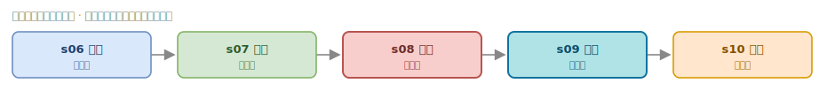
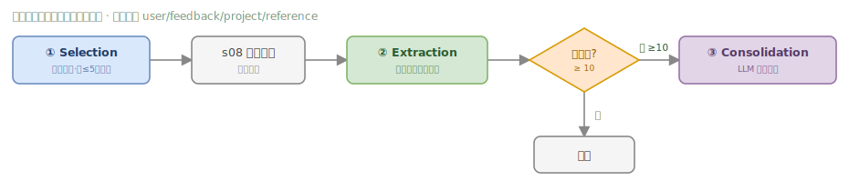

# 02 · Context Engineering (s06–s10)

**[中文](02-context.md)** · English

> The most central chapter of the whole project — making the Agent **run long and remember**. Context is the agent's scarcest resource.



Five progressive layers, each plugging the hole of the previous one: isolation (prevent contamination) → on-demand (save space) → compaction (prevent overflow) → memory (recover loss) → assembly (stay dynamic).

---

## s06 · Subagent (context isolation)

The `task` tool spawns a subagent with a **brand-new `messages[]`**, lets it run its own loop, and when done **returns only the final summary** — discarding all the intermediate steps. Like "opening a new terminal, finishing the job, closing it, and bringing the result back to the main terminal."

⚠️ Key distinction: what's isolated is **context**, not **permissions** — the subagent's tool calls still go through the `PreToolUse` hook. The subagent has no `task` tool, preventing infinite recursion.

> **Motto: Break the big task into small ones, each with a clean context.**

## s07 · Skill on-demand loading (two tiers)

Stuffing large documents (React conventions, SQL style, API design…) entirely into the system prompt wastes context. Two-tier loading solves it:

```
At startup:  scan skills/, keep  name + description (~100 tokens)  resident in SYSTEM   ← cheap catalog
At runtime:  load_skill(name) injects the  full SKILL.md (~2000 tokens)                ← expensive content on demand
```

This keeps the agent always "aware of what capabilities exist" (low cost), while full content loads only when used (on-demand cost).

> **Motto: Load it when you need it, don't stuff it all into the prompt.**

## s08 · Context compaction (four-tier pipeline)

After continuous work, `messages` swells until it bursts the context. The core idea is **run the cheap ones first, the expensive ones last** — whatever can be solved with 0 API calls should never call the LLM:

```
Before each LLM call:
  L3 tool_result_budget  spill big results to disk (>30KB)   ─┐
  L1 snip_compact        trim the middle (keep first 3 + last 47)  ├─ 0 API calls
  L2 micro_compact       swap old results for placeholders   ─┘
        │
        ▼  still > threshold (50K tokens)?
  L4 compact_history      full LLM summary          ── 1 API call
        │
        ▼  API returns 413?
  reactive_compact        aggressive trim, retry once   ── emergency
```

> Order is critical: **L3 must come before L2** — otherwise a big result gets replaced by a placeholder before it's spilled to disk. `compact_history` saves the full conversation into `.transcripts/` so details can be recovered later; the summary must keep 5 kinds of information: current goal, important findings, files changed, remaining work, user constraints.

> **Motto: Context always fills up — you need a way to make room (and a systematic, tiered strategy).**

## s09 · Memory (across compaction / across sessions)

s08's compaction inevitably loses detail ("tab vs spaces" gets simplified to "code style preference"), and it can't remember across sessions. The memory system has three stages:



- **Selection**: at the start of each round, use an LLM side-query to pick ≤5 relevant memories from the store and inject them into the current turn.
- **Extraction**: at the end of each round, extract new memories from the **pre-compaction snapshot** (not from post-compaction data, to guarantee information completeness).
- **Consolidation**: when memory files accumulate to ≥10, trigger the LLM to dedupe, merge, and retire stale items.

Storage is files: the `.memory/MEMORY.md` index stays resident in SYSTEM (~100 tokens/round), and each memory is a `.md` with frontmatter. Four kinds of memory: `user` (who is who) / `feedback` (how to do things) / `project` (what happened) / `reference` (where to find things).

> **Motto: Compaction loses detail — you need one layer that doesn't.**

## s10 · System Prompt runtime assembly

The SYSTEM prompt upgrades from a hardcoded string into a **config assembled from real state**. `PROMPT_SECTIONS` is stitched together on demand (e.g., the memory section loads only when `.memory/MEMORY.md` exists), using `json.dumps` (not `hash()`) as the cache key to avoid redundant in-process re-assembly. Whether to load a section is decided by **real file/tool state**, not by keyword-guessing in the messages.

> **Motto: The prompt is assembled, not hardcoded.**

---

## 📍 Code anchors (straight to the source)

- **s06** spawn_subagent [`code.py:207`](https://github.com/shareAI-lab/learn-claude-code/blob/main/s06_subagent/code.py#L207) · SUB_HANDLERS (no task, recursion banned) [`:196`](https://github.com/shareAI-lab/learn-claude-code/blob/main/s06_subagent/code.py#L196) · task tool registration [`:253`](https://github.com/shareAI-lab/learn-claude-code/blob/main/s06_subagent/code.py#L253)
- **s07** _scan_skills [`code.py:69`](https://github.com/shareAI-lab/learn-claude-code/blob/main/s07_skill_loading/code.py#L69) · SKILL_REGISTRY [`:67`](https://github.com/shareAI-lab/learn-claude-code/blob/main/s07_skill_loading/code.py#L67)
- **s08** tool_result_budget(L3) [`code.py:339`](https://github.com/shareAI-lab/learn-claude-code/blob/main/s08_context_compact/code.py#L339) · snip_compact(L1) [`:295`](https://github.com/shareAI-lab/learn-claude-code/blob/main/s08_context_compact/code.py#L295) · micro_compact(L2) [`:322`](https://github.com/shareAI-lab/learn-claude-code/blob/main/s08_context_compact/code.py#L322) · compact_history(L4) [`:375`](https://github.com/shareAI-lab/learn-claude-code/blob/main/s08_context_compact/code.py#L375) · reactive_compact [`:383`](https://github.com/shareAI-lab/learn-claude-code/blob/main/s08_context_compact/code.py#L383)
- **s09** select_relevant_memories [`code.py:132`](https://github.com/shareAI-lab/learn-claude-code/blob/main/s09_memory/code.py#L132) · extract_memories [`:222`](https://github.com/shareAI-lab/learn-claude-code/blob/main/s09_memory/code.py#L222) · consolidate_memories [`:287`](https://github.com/shareAI-lab/learn-claude-code/blob/main/s09_memory/code.py#L287)
- **s10** PROMPT_SECTIONS [`code.py:42`](https://github.com/shareAI-lab/learn-claude-code/blob/main/s10_system_prompt/code.py#L42) · assemble_system_prompt [`:50`](https://github.com/shareAI-lab/learn-claude-code/blob/main/s10_system_prompt/code.py#L50) · get_system_prompt (cached) [`:71`](https://github.com/shareAI-lab/learn-claude-code/blob/main/s10_system_prompt/code.py#L71)

---

← [01 Foundations](01-foundations.en.md) · Next → [03 Robustness & Orchestration (s11–s14)](03-robustness.en.md)
