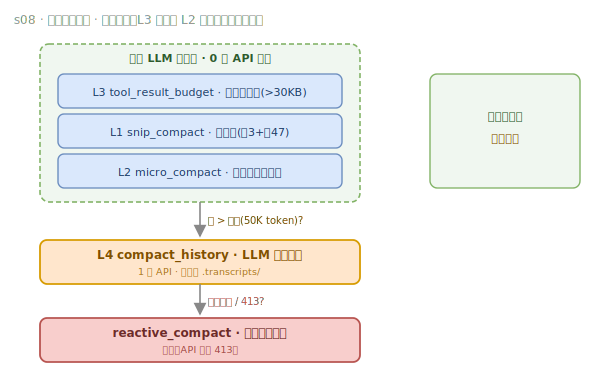

# 02 · 上下文工程（s06–s10）

**[English](02-context.en.md)** · 中文


> 全项目最核心的一篇——让 Agent **跑得久、记得住**。上下文是 agent 最稀缺的资源。


五层递进，每层补上一层的窟窿：隔离（防污染）→ 按需（省空间）→ 压缩（防溢出）→ 记忆（补丢失）→ 组装（保动态）。

---

## s06 · 子 Agent（上下文隔离）

`task` 工具 spawn 出一个**全新 `messages[]`** 的子 Agent，让它跑自己的循环，跑完**只回传最后摘要**，中间过程全部丢弃。如同「开一个新终端，干完关掉，结果带回主终端」。

⚠️ 关键区分：隔离的是**上下文**，不是**权限**——子 Agent 的工具调用仍要过 `PreToolUse` 钩子。子 Agent 没有 `task` 工具，防止无限递归。

> **Motto：大任务拆小，每个小任务干净的上下文。**

## s07 · Skill 按需加载（两层）

大文档（React 规范、SQL 风格、API 设计…）全塞 system prompt 会浪费上下文。两层加载解决：

```
启动时：扫描 skills/，把  name + description（~100 token）  常驻 SYSTEM   ← 廉价目录
运行时：load_skill(name)，才注入  完整 SKILL.md（~2000 token）          ← 昂贵内容按需
```

让 agent 始终「知道有什么能力」（低成本），完整内容只在用到时加载（按需成本）。

> **Motto：用到时再加载，别全塞 prompt 里。**

## s08 · 上下文压缩（四层管线）

连续工作后 `messages` 会膨胀到撑爆上下文。核心思想是**便宜的先跑、贵的后跑**，能用 0 次 API 解决的绝不调 LLM：



<details><summary>📄 ASCII 版（终端可读）</summary>

```
每轮 LLM 调用前：
  L3 tool_result_budget  大结果落盘(>30KB)   ─┐
  L1 snip_compact        裁中段(保留头3+尾47)  ├─ 0 次 API 调用
  L2 micro_compact       旧结果换占位符        ─┘
        │
        ▼  仍 > 阈值(50K token)?
  L4 compact_history      LLM 全量摘要          ── 1 次 API
        │
        ▼  API 返回 413?
  reactive_compact        激进裁剪重试一次       ── 应急
```

</details>

> 顺序关键：**L3 必须在 L2 前**——否则大结果还没存盘就被占位符替换了。`compact_history` 会把完整对话存进 `.transcripts/` 以便事后恢复细节，摘要要保留 5 类信息：当前目标、重要发现、已改文件、剩余工作、用户约束。

> **Motto：上下文总会满，要有办法腾地方（而且要有系统的分层策略）。**

## s09 · 记忆（跨压缩 / 跨会话）

s08 的压缩必然丢细节（「tab vs 空格」被简化成「代码风格偏好」），且跨会话无法记忆。记忆系统有三个环节：


- **Selection（选择）**：每轮开头，用 LLM side-query 从记忆库选出 ≤5 条相关记忆，注入当前 turn。
- **Extraction（提取）**：每轮结束，在**压缩前的快照**上提取新记忆（不在压缩后数据上做，保证信息完整）。
- **Consolidation（整理）**：记忆文件累积到 ≥10 个时，触发 LLM 去重合并、淘汰过时项。

存储是文件：`.memory/MEMORY.md` 索引常驻 SYSTEM（~100 token/轮），单条记忆是带 frontmatter 的 `.md`。四类记忆：`user`（谁是谁）/ `feedback`（怎么做）/ `project`（发生什么）/ `reference`（哪里找）。

> **Motto：压缩会丢细节，要有一层不丢的。**

## s10 · System Prompt 运行时组装

SYSTEM prompt 从硬编码字符串升级为**按真实状态组装的配置**。`PROMPT_SECTIONS` 按需拼接（如 `.memory/MEMORY.md` 存在才加载 memory 段），用 `json.dumps`（而非 `hash()`）做 cache key 避免进程内重复拼接。是否加载某段由**真实文件/工具状态**决定，而非消息里的关键词猜测。

> **Motto：Prompt 是组装出来的，不是写死的。**

---

## 📍 代码锚点（直达源码）

- **s06** spawn_subagent [`code.py:207`](https://github.com/shareAI-lab/learn-claude-code/blob/main/s06_subagent/code.py#L207) · SUB_HANDLERS（无 task，禁递归）[`:196`](https://github.com/shareAI-lab/learn-claude-code/blob/main/s06_subagent/code.py#L196) · task 工具注册 [`:253`](https://github.com/shareAI-lab/learn-claude-code/blob/main/s06_subagent/code.py#L253)
- **s07** _scan_skills [`code.py:69`](https://github.com/shareAI-lab/learn-claude-code/blob/main/s07_skill_loading/code.py#L69) · SKILL_REGISTRY [`:67`](https://github.com/shareAI-lab/learn-claude-code/blob/main/s07_skill_loading/code.py#L67)
- **s08** tool_result_budget(L3) [`code.py:339`](https://github.com/shareAI-lab/learn-claude-code/blob/main/s08_context_compact/code.py#L339) · snip_compact(L1) [`:295`](https://github.com/shareAI-lab/learn-claude-code/blob/main/s08_context_compact/code.py#L295) · micro_compact(L2) [`:322`](https://github.com/shareAI-lab/learn-claude-code/blob/main/s08_context_compact/code.py#L322) · compact_history(L4) [`:375`](https://github.com/shareAI-lab/learn-claude-code/blob/main/s08_context_compact/code.py#L375) · reactive_compact [`:383`](https://github.com/shareAI-lab/learn-claude-code/blob/main/s08_context_compact/code.py#L383)
- **s09** select_relevant_memories [`code.py:132`](https://github.com/shareAI-lab/learn-claude-code/blob/main/s09_memory/code.py#L132) · extract_memories [`:222`](https://github.com/shareAI-lab/learn-claude-code/blob/main/s09_memory/code.py#L222) · consolidate_memories [`:287`](https://github.com/shareAI-lab/learn-claude-code/blob/main/s09_memory/code.py#L287)
- **s10** PROMPT_SECTIONS [`code.py:42`](https://github.com/shareAI-lab/learn-claude-code/blob/main/s10_system_prompt/code.py#L42) · assemble_system_prompt [`:50`](https://github.com/shareAI-lab/learn-claude-code/blob/main/s10_system_prompt/code.py#L50) · get_system_prompt（缓存）[`:71`](https://github.com/shareAI-lab/learn-claude-code/blob/main/s10_system_prompt/code.py#L71)

---

← [01 基础设施](01-foundations.md) · 下一篇 → [03 健壮性与编排（s11–s14）](03-robustness.md)
