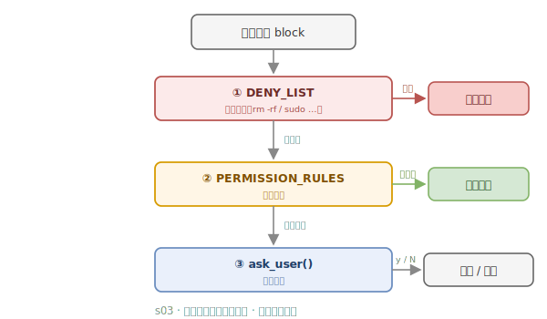

# s03 · Permission pipeline — three gates before execution

> **Motto: trust the code, not the model.**

## What this lesson solves

A model that can call Bash can call dangerous commands. You can't rely on "trusting the model to behave" — you must enforce checks in code. s03 chains three gates before a tool runs: a deny list, rule matching, and human confirmation, moving the safety boundary from the model into the code.

## How the mechanism works

Before a tool runs, it passes three gates in order: `DENY_LIST` → `PERMISSION_RULES` → `ask_user()`.



<details><summary>📄 ASCII version (terminal-friendly)</summary>

```
tool-call block
      │
      ▼
┌───────────────┐  hit     ┌──────────────┐
│ ① DENY_LIST   │ ───────► │   reject      │
│  deny list     │          └──────────────┘
└───────┬───────┘
        │ no hit
        ▼
┌───────────────┐ no rule   ┌──────────────┐
│ ② RULES match │ ───────► │    allow      │
└───────┬───────┘          └──────────────┘
        │ rule hit
        ▼
┌───────────────┐  y / N   ┌──────────────┐
│ ③ ask_user()  │ ───────► │ allow / reject│
└───────────────┘          └──────────────┘
```

</details>

- ① `DENY_LIST`: hard deny list — a hit is rejected outright.
- ② `PERMISSION_RULES`: rule matching — no matching rule means allow.
- ③ `ask_user()`: a rule hit is sent to a human — y allows / N rejects.

## Key insights

- Safety is the harness's responsibility, not the model's — enforce it in code.
- The gates are ordered strict-to-loose: check the absolutely forbidden first, then rules, and only ask a human last.

## 📍 Code anchors (jump to source)

- DENY_LIST [`code.py:150`](https://github.com/shareAI-lab/learn-claude-code/blob/main/s03_permission/code.py#L150) · RULES [`:160`](https://github.com/shareAI-lab/learn-claude-code/blob/main/s03_permission/code.py#L160) · ask_user [`:177`](https://github.com/shareAI-lab/learn-claude-code/blob/main/s03_permission/code.py#L177) · check_permission [`:185`](https://github.com/shareAI-lab/learn-claude-code/blob/main/s03_permission/code.py#L185)

---
← [Previous](s02.md) · [Course overview](../../../README.en.md) · Next → [s04](s04.md)
