# s15 · Agent Teams — File Inboxes

> **Motto: One can't do it? Form a team.**

## What this lesson solves

A single agent works serially and runs out of steam on big tasks that could be split and parallelized. This lesson lets multiple agents form a team: the Lead hands out work, teammates work in parallel, and report back when done. The key is a reliable communication channel that guarantees each message is processed exactly once.

## How it works

`MessageBus` is built on file inboxes `.mailboxes/{agent}.jsonl`:

- **Send** = append one line of JSON.
- **Read** = read + unlink (**consuming read**, ensuring each message is handled exactly once).

The Lead spawns teammate threads, each with a slimmed-down toolset (bash / read / write / send_message). Teammates work in parallel and, when done, send a summary back to the Lead's inbox; on its next turn the Lead checks the inbox and injects the teammates' reports into its own history.

## Key insights

- "Consuming read" (read + unlink) is the key to exactly-once — a message is deleted the moment it's read, naturally preventing duplicate consumption.
- File inboxes need no message broker: append + unlink is a minimal reliable queue, reusing s12's "the file is the persistence" idea.
- Teammates get a slimmed-down toolset, not the full set — the capability boundary is the safety boundary.

## 📍 Code anchors (straight to source)

- MessageBus [`code.py:595`](https://github.com/shareAI-lab/learn-claude-code/blob/main/s15_agent_teams/code.py#L595)
- send [`code.py:600`](https://github.com/shareAI-lab/learn-claude-code/blob/main/s15_agent_teams/code.py#L600)
- read_inbox (consuming) [`code.py:611`](https://github.com/shareAI-lab/learn-claude-code/blob/main/s15_agent_teams/code.py#L611)
- spawn_teammate_thread [`code.py:629`](https://github.com/shareAI-lab/learn-claude-code/blob/main/s15_agent_teams/code.py#L629)

---
← Previous [s14](s14.md) · [Course overview](../../../README.en.md) · Next → [s16](s16.md)
