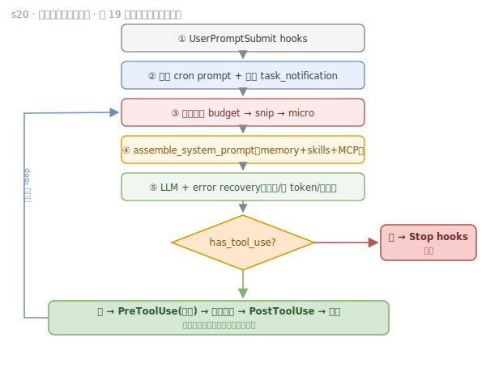

# s20 · All Mechanisms · One Loop — Many Mechanisms, One Loop

> **Motto: Many mechanisms, one loop.**

## The problem this lesson solves

Each of the previous 19 lessons added exactly one mechanism. s20 invents no new concept; it puts those 19 mechanisms back into their engineering place around **one and the same loop**, proving a single point: even with 27 tools, permissions, memory, compaction, recovery, background, cron, teams, worktree, and MCP all packed in, the innermost layer is still that ~30-line loop.

## How the mechanism works

The full harness pipeline (all 19 mechanisms "hang" around that 30-line loop):



<details><summary>📄 ASCII version (terminal-friendly)</summary>

```
user input ─► UserPromptSubmit hooks
        ─► inject cron-triggered prompt + background-completed task_notification
        ─► compaction pipeline (budget → snip → micro)
        ─► assemble_system_prompt (memory + skills + MCP + time)
        ─► LLM  with error recovery (429/529 retry / token escalation / compaction)
        ─► has_tool_use?
             ├─ yes ─► PreToolUse hooks(permission) ─► assemble_tool_pool(built-in + MCP)
             │         ─► dispatch ─► background thread or inline ─► PostToolUse hooks ─► fill back ─► next round
             └─ no  ─► Stop hooks ─► return
```

</details>

Note: the innermost layer is still that 30-line loop (`call LLM → has tool_use? → execute → append → repeat`); all 19 mechanisms hang around it.

After integration, two elegant symmetries emerge:

```
Four-layer planning system            Two-layer delegation
──────────────────────────            ─────────────────────
session todo  (memory · in-session)   subagent  (one-shot · isolated · drops intermediates)
task graph    (file · DAG · cross-session)  teammate (persistent thread · MessageBus · autonomous)
skill catalog (load on demand)
cron          (timed injection)
```

- The **four-layer planning system** covers different time scales: from a lightweight in-session todo, to a cross-session file task graph, to an on-demand skill catalog, to timed cron injection.
- The **two-layer delegation** covers different collaboration intensities: a subagent is "one-shot, isolated, drops intermediate results", a teammate is "persistent thread, communicates via MessageBus, claims work autonomously".

## Key insight

- An agent's complexity comes from the complexity of a **mature harness**, not from the brain itself.
- Even after packing in 27 tools and every mechanism, the core loop is still that one line `while stop_reason == "tool_use"`.
- The two symmetries (planning layered by time scale, delegation layered by collaboration intensity) show these mechanisms aren't a pile-up — each occupies its own orthogonal dimension.

## 📍 Code anchors (jump straight to source)

- agent_loop (main loop) [`code.py:1955`](https://github.com/shareAI-lab/learn-claude-code/blob/main/s20_comprehensive/code.py#L1955) · assemble_system_prompt [`:360`](https://github.com/shareAI-lab/learn-claude-code/blob/main/s20_comprehensive/code.py#L360) · assemble_tool_pool (built-in + MCP) [`:1629`](https://github.com/shareAI-lab/learn-claude-code/blob/main/s20_comprehensive/code.py#L1629) · spawn_subagent [`:1023`](https://github.com/shareAI-lab/learn-claude-code/blob/main/s20_comprehensive/code.py#L1023) · spawn_teammate_thread [`:624`](https://github.com/shareAI-lab/learn-claude-code/blob/main/s20_comprehensive/code.py#L624)

---
← Previous [s19](s19.md) · [Course overview](../../../README.en.md) · Next → [Three-way comparison](../../../compare/claude-code-vs-pi.md) · [Decision table](../../../cheatsheets/decision-table.md)
