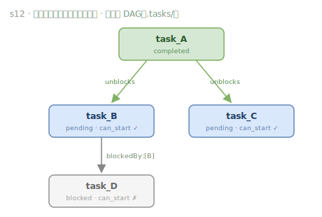

# s12 · 任务图(DAG) — 文件化的依赖图

> **Motto：大目标拆成小任务，排好序，持久化。**

## 这一课解决什么问题

大目标一口吃不下，需要拆成小任务、排好执行顺序、并且能跨会话恢复。这一课把任务建成一张有向无环图（DAG）：每个任务一个 JSON 文件，用 `blockedBy` 声明上游依赖。无需数据库，文件持久化天然支持跨会话恢复，`owner` 字段还能在多 Agent 场景防止重复认领。

## 机制怎么实现

每个任务是一条 JSON 记录（`id / subject / status / owner / blockedBy`），存成 `.tasks/{id}.json`。`can_start()` 检查 `blockedBy` 里的上游是否全部完成，全完成才允许认领；任务完成后扫描并报告被解锁的下游。



<details><summary>📄 ASCII 版（终端可读）</summary>

```
        ┌──────────┐
        │ task_A   │ completed
        └────┬─────┘
             │ unblocks
       ┌─────┴─────┐
       ▼           ▼
  ┌─────────┐ ┌─────────┐
  │ task_B  │ │ task_C  │  pending（blockedBy:[A] 已满足 → can_start ✓）
  └────┬────┘ └─────────┘
       │ blockedBy:[B]
       ▼
  ┌─────────┐
  │ task_D  │ blocked（上游 B 未完成 → can_start ✗）
  └─────────┘
```

</details>

## 关键洞见

- 文件即数据库：每任务一个 JSON，持久化天然支持跨会话恢复，无需引入真正的数据库。
- `owner` 字段是多 Agent 协作的基石——它防止两个 Agent 认领同一任务。
- `blockedBy` + `can_start()` 把「执行顺序」声明化，调度逻辑只需查依赖是否满足。

## 📍 代码锚点（直达源码）

- create_task [`code.py:66`](https://github.com/shareAI-lab/learn-claude-code/blob/main/s12_task_system/code.py#L66)
- can_start（依赖校验）[`code.py:99`](https://github.com/shareAI-lab/learn-claude-code/blob/main/s12_task_system/code.py#L99)
- blockedBy 字段 [`code.py:59`](https://github.com/shareAI-lab/learn-claude-code/blob/main/s12_task_system/code.py#L59)

---
← 上一课 [s11](s11.md) · [课程总览](../../README.md) · 下一课 → [s13](s13.md)
